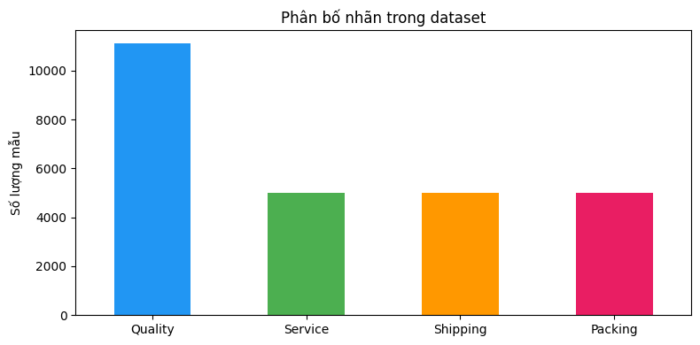
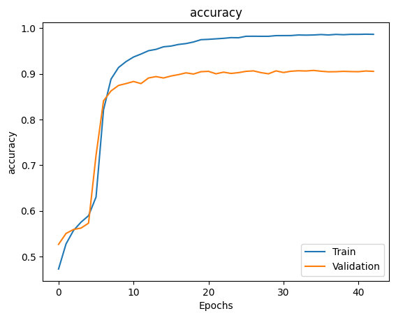
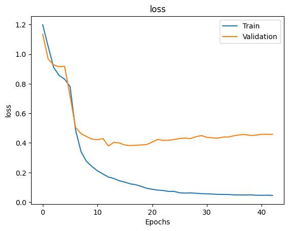
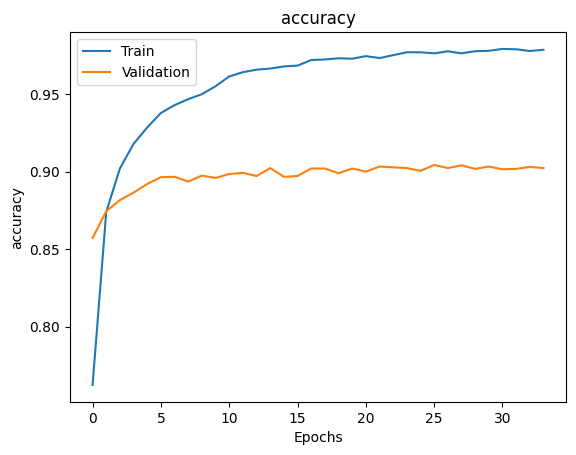
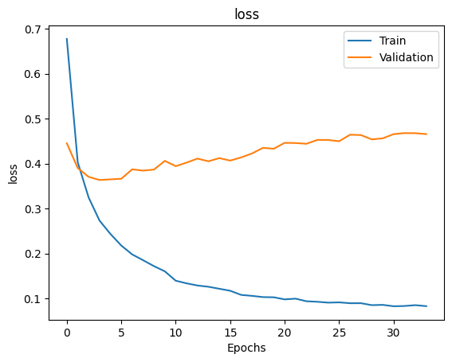
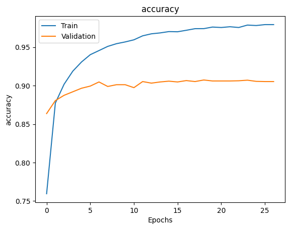
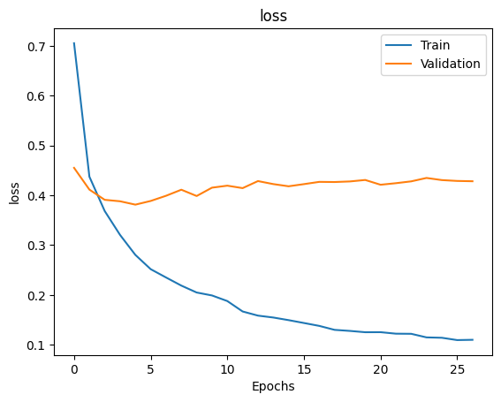
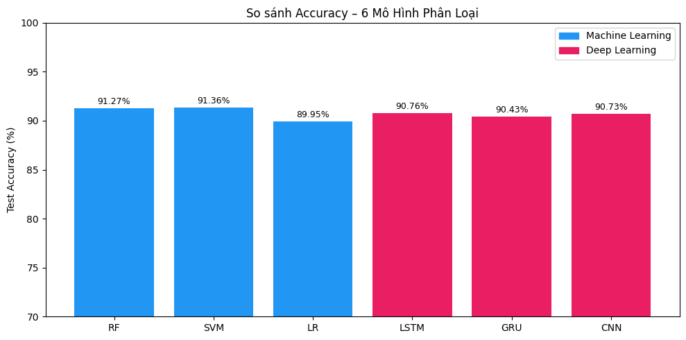

# Báo cáo: Phân loại phản ánh người dùng trên sàn thương mại điện tử

**Môn học:** IT4930 – Khoa học Dữ liệu  
**Nhóm:** 21  
**Trường:** Đại học Bách Khoa Hà Nội – Trường CNTT & Truyền thông  
**Giảng viên:** PGS. TS. Thân Quang Khoát  

---

## 1. Giới thiệu

### 1.1 Bài toán

Trong bối cảnh thương mại điện tử phát triển mạnh, hàng triệu bình luận đánh giá sản phẩm được đăng tải mỗi ngày trên các sàn như Tiki. Việc phân tích tự động các phản ánh tiêu cực giúp doanh nghiệp nhanh chóng nhận diện vấn đề và cải thiện trải nghiệm khách hàng.

**Mục tiêu:** Xây dựng mô hình phân loại tự động các bình luận tiêu cực (rating ≤ 3 sao) trên Tiki thành 4 khía cạnh:

| Nhãn | Ý nghĩa |
|---|---|
| **Quality** | Chất lượng sản phẩm |
| **Service** | Dịch vụ khách hàng |
| **Shipping** | Vận chuyển |
| **Packing** | Đóng gói |

### 1.2 Phương pháp tiếp cận

Nhóm triển khai và so sánh **6 mô hình phân loại**:
- **Machine Learning:** Random Forest, SVM, Logistic Regression (đặc trưng TF-IDF)
- **Deep Learning:** LSTM, GRU, CNN (đặc trưng Embedding)

---

## 2. Thu thập dữ liệu

**Nguồn:** Tiki API  
**Quy trình:**
1. Thu thập product ID qua API danh mục (`/api/personalish/v1/blocks/listings`)
2. Thu thập bình luận qua API review (`/api/v2/reviews?product_id=...`)
3. Chỉ giữ lại bình luận có **rating ≤ 3** (bình luận tiêu cực)

**Gán nhãn thủ công:** Mỗi bình luận được gán đúng 1 trong 4 nhãn (single-label) bởi thành viên nhóm.

---

## 3. Tiền xử lý dữ liệu

Pipeline xử lý văn bản tiếng Việt gồm các bước:

1. **Chuẩn hóa Unicode** – Chuyển về chuẩn NFC (Canonical Composition)
2. **Chuẩn hóa dấu câu** – Thống nhất kiểu gõ dấu tiếng Việt, xử lý đặc biệt "qu" và "gi"
3. **Lowercase** – Chuyển toàn bộ về chữ thường
4. **Loại bỏ tag HTML, URL**
5. **Loại bỏ emoji**
6. **Loại bỏ stopwords** – Dựa trên danh sách từ dừng tiếng Việt
7. **Loại bỏ dấu câu và ký tự đặc biệt**
8. **Chuẩn hóa từ viết tắt** – "k" → "không", "sp" → "sản phẩm", "ship" → "giao hàng", v.v.
9. **Loại bỏ ký tự lặp** – Giới hạn tối đa 2 ký tự liên tiếp giống nhau
10. **Lọc văn bản không hợp lệ** – Loại câu quá ngắn hoặc chỉ chứa số

---

## 4. Xử lý mất cân bằng dữ liệu

**Vấn đề:** Sau khi thu thập và gán nhãn thủ công, dữ liệu bị mất cân bằng nghiêm trọng — nhãn Quality chiếm đa số, trong khi 3 nhãn còn lại có số lượng ít hơn nhiều.

**Giải pháp: Synonym Replacement**  
Thay thế một số từ trong câu bằng từ đồng nghĩa để tạo thêm mẫu cho các nhãn thiểu số, giữ nguyên nhãn gốc.

**Kết quả sau augmentation:**


*Hình 1: Phân bố nhãn trong dataset sau augmentation*

| Nhãn | Số mẫu | Tỉ lệ |
|---|---|---|
| Quality | ~11,000 | ~42.6% |
| Service | ~5,000 | ~19.1% |
| Shipping | ~5,000 | ~19.1% |
| Packing | ~5,000 | ~19.1% |
| **Tổng** | **26,110** | **100%** |

---

## 5. Phương pháp phân loại

### 5.1 Machine Learning — TF-IDF

**Đặc trưng:** `TfidfVectorizer` với cấu hình:
- `ngram_range=(1,2)` – bắt bigram, nhận diện cụm từ như "giao hàng chậm", "đóng gói kỹ"
- `sublinear_tf=True` – giảm ảnh hưởng của từ xuất hiện quá nhiều

**Xử lý mất cân bằng:** `class_weight='balanced'` cho tất cả ML models.

**Phân chia dữ liệu:** Train 80% (20,888 mẫu) / Test 20% (5,222 mẫu)

#### a) Random Forest

- **Thuật toán:** Ensemble học kết hợp nhiều cây quyết định (Bagging + Random Feature Selection)
- **Dự đoán:** Majority voting
- **Cấu hình:** `n_estimators=200`, `class_weight='balanced'`, `random_state=42`
- **Ưu điểm:** Ổn định, giảm overfitting, xử lý tốt dữ liệu mất cân bằng

#### b) Support Vector Machine (SVM)

- **Thuật toán:** Tìm siêu phẳng tối ưu phân tách các lớp, cực đại hóa margin
- **Cấu hình:** `kernel='linear'`, `class_weight='balanced'`, `random_state=42`
- **Ưu điểm:** Hiệu quả cao trên không gian TF-IDF chiều cao (hàng chục nghìn features bigram)

#### c) Logistic Regression

- **Thuật toán:** Sử dụng hàm softmax để dự đoán xác suất thuộc lớp
- **Cấu hình:** `class_weight='balanced'`, `max_iter=1000`, regularization L2 mặc định
- **Ưu điểm:** Đơn giản, ít tốn tài nguyên, có regularization kiểm soát overfitting tốt

---

### 5.2 Deep Learning — Embedding

**Tokenizer:** `Tokenizer(num_words=8000, oov_token='<OOV>')`  
**Padding:** `maxlen=120`, `padding='post'`  
**Embedding:** Trainable, `EMBEDDING_DIM=48`  
**Phân chia dữ liệu:** Train 85% (22,193 mẫu) / Validation 15% (3,917 mẫu)

**Kỹ thuật tối ưu chung:**
- `EarlyStopping(monitor='val_accuracy', patience=8, restore_best_weights=True)`
- `ReduceLROnPlateau(monitor='val_loss', factor=0.5, patience=6, min_lr=1e-6)`

#### a) LSTM (Long Short-Term Memory)

**Kiến trúc:**
```
Embedding(8262, 48, trainable=True)
→ Dropout(0.3)
→ Conv1D(64, kernel=5, relu)
→ MaxPooling1D(pool_size=4)
→ LSTM(64)
→ Dense(4, softmax)
```
- **Ưu điểm:** Ghi nhớ phụ thuộc dài hạn trong chuỗi văn bản
- **Conv1D + MaxPool** trước LSTM giúp trích xuất đặc trưng cục bộ trước khi đưa vào LSTM

#### b) GRU (Gated Recurrent Unit)

**Kiến trúc:**
```
Embedding(8262, 48, trainable=True)
→ SpatialDropout1D(0.3)
→ Bidirectional(GRU(64))
→ Dropout(0.3)
→ Dense(32, relu, L2=0.0005)
→ Dropout(0.3)
→ Dense(4, softmax)
```
- **Ưu điểm:** Đơn giản hơn LSTM, học nhanh hơn
- **Bidirectional:** Xử lý chuỗi theo cả 2 chiều, tăng khả năng nắm bắt ngữ cảnh

#### c) CNN (Convolutional Neural Network)

**Kiến trúc:**
```
Embedding(8262, 48, trainable=True)
→ SpatialDropout1D(0.3)
→ Conv1D(128, kernel=5, relu, L2=0.0005)
→ GlobalMaxPooling1D
→ Dropout(0.3)
→ Dense(32, relu, L2=0.0005)
→ Dropout(0.3)
→ Dense(4, softmax)
```
- **Ưu điểm:** Trích xuất đặc trưng cục bộ nhanh, training nhanh nhất
- **GlobalMaxPooling:** Lấy đặc trưng quan trọng nhất từ mỗi filter, phù hợp với review ngắn

---

## 6. Kết quả đánh giá

### 6.1 Machine Learning Models

#### Random Forest — 91.27%

| Nhãn | Precision | Recall | F1-score | Support |
|---|---|---|---|---|
| Packing | 0.95 | 0.98 | **0.97** | 1,000 |
| Quality | 0.93 | 0.90 | 0.91 | 2,185 |
| Service | 0.87 | 0.86 | 0.87 | 1,036 |
| Shipping | 0.88 | 0.93 | 0.90 | 1,001 |
| **Weighted avg** | **0.91** | **0.91** | **0.91** | 5,222 |

#### SVM — 91.36% *(Best overall)*

| Nhãn | Precision | Recall | F1-score | Support |
|---|---|---|---|---|
| Packing | 0.94 | 0.99 | **0.96** | 1,000 |
| Quality | 0.95 | 0.88 | 0.91 | 2,185 |
| Service | 0.86 | 0.88 | 0.87 | 1,036 |
| Shipping | 0.87 | 0.95 | 0.91 | 1,001 |
| **Weighted avg** | **0.92** | **0.91** | **0.91** | 5,222 |

#### Logistic Regression — 89.95%

| Nhãn | Precision | Recall | F1-score | Support |
|---|---|---|---|---|
| Packing | 0.93 | 0.98 | **0.95** | 1,000 |
| Quality | 0.94 | 0.87 | 0.90 | 2,185 |
| Service | 0.84 | 0.86 | 0.85 | 1,036 |
| Shipping | 0.86 | 0.92 | 0.89 | 1,001 |
| **Weighted avg** | **0.90** | **0.90** | **0.90** | 5,222 |

---

### 6.2 Deep Learning Models

#### LSTM — 90.76% *(Best DL model)*

Training: 43 epochs, best weights tại epoch 35.


*Hình 2: LSTM – Training curve (Accuracy)*


*Hình 3: LSTM – Training curve (Loss)*

**Nhận xét:**
- Giai đoạn E1–E5: accuracy thấp (47–59%) do lớp Conv1D cần thời gian khởi động
- E6–E7: đột phá mạnh lên 72% → 84% khi Conv1D hội tụ và LSTM bắt đầu học
- Từ E8 trở đi: val accuracy ổn định quanh 88–91%, train accuracy tiếp tục tăng → dấu hiệu overfitting
- Gap tại best epoch (E35): train 98.52% – val 90.76% = **7.76%**

#### GRU — 90.43%

Training: 34 epochs, best weights tại epoch 26.


*Hình 4: GRU – Training curve (Accuracy)*


*Hình 5: GRU – Training curve (Loss)*

**Nhận xét:**
- Hội tụ nhanh ngay từ E1 (76.24%) nhờ kiến trúc đơn giản không có Conv1D trước recurrent layer
- Val accuracy đạt 89.63% ở E6 và tiếp tục tăng chậm lên 90.43% ở E26
- Gap tại best epoch (E26): train 97.63% – val 90.43% = **7.20%**

#### CNN — 90.73%

Training: 27 epochs, best weights tại epoch 19.


*Hình 6: CNN – Training curve (Accuracy)*


*Hình 7: CNN – Training curve (Loss)*

**Nhận xét:**
- Hội tụ nhanh nhất trong 3 DL models (best epoch E19, dừng sớm nhất E27)
- Val accuracy đạt 90% từ E7 và tiếp tục cải thiện nhẹ đến E19
- Gap tại best epoch (E19): train 97.40% – val 90.73% = **6.67%** (thấp nhất trong 3 DL)

---

### 6.3 So sánh tổng hợp


*Hình 8: So sánh accuracy 6 mô hình phân loại*

| Hạng | Model | Loại | Accuracy | Precision | Recall | F1 |
|---|---|---|---|---|---|---|
| 1 | **SVM** | ML | **91.36%** | 0.9151 | 0.9136 | 0.9135 |
| 2 | Random Forest | ML | 91.27% | 0.9132 | 0.9127 | 0.9126 |
| 3 | **LSTM** | DL | **90.76%** | — | — | — |
| 4 | CNN | DL | 90.73% | — | — | — |
| 5 | GRU | DL | 90.43% | — | — | — |
| 6 | Logistic Regression | ML | 89.95% | 0.9011 | 0.8995 | 0.8995 |

**Phân tích overfitting DL models:**

| Model | Train acc (best epoch) | Val acc | Gap | EarlyStopping |
|---|---|---|---|---|
| LSTM | 98.52% (E35) | 90.76% | 7.76% | Dừng E43 |
| GRU | 97.63% (E26) | 90.43% | 7.20% | Dừng E34 |
| CNN | 97.40% (E19) | 90.73% | **6.67%** | Dừng E27 |

---

## 7. Thảo luận

### 7.1 So sánh ML vs Deep Learning

Kết quả cho thấy ML models (SVM, RF) nhỉnh hơn DL models khoảng 0.5–1%:

- **ML models** hưởng lợi từ TF-IDF bigram với class_weight='balanced' — hiệu quả cao trên dữ liệu văn bản tiếng Việt ngắn với vocabulary hữu hạn. SVM đặc biệt phù hợp do không gian TF-IDF bigram có hàng chục nghìn chiều, nơi kernel tuyến tính hoạt động tối ưu.

- **DL models** bị giới hạn bởi kích thước dataset (~22,000 mẫu train) và dữ liệu augmented (synonym replacement tạo ra các mẫu rất giống nhau), dẫn đến overfitting gap 7–8% giữa train và validation accuracy.

### 7.2 Phân tích theo nhãn

Nhãn **Service** là khó phân loại nhất (F1 thấp nhất ~0.85–0.87) ở tất cả models:
- Từ vựng về dịch vụ khách hàng overlap nhiều với các nhãn khác ("không hỗ trợ đổi trả" liên quan đến cả Quality lẫn Service)
- Số mẫu gốc trước augmentation ít hơn các nhãn khác

Nhãn **Packing** dễ phân loại nhất (F1 cao nhất ~0.95–0.97):
- Từ vựng đặc trưng rõ ràng ("đóng gói", "hộp", "bọc", "vỡ do vận chuyển")
- Ít bị nhầm lẫn với các nhãn khác

### 7.3 Model phù hợp theo từng tiêu chí

| Tiêu chí | Model được chọn | Lý do |
|---|---|---|
| Accuracy cao nhất | SVM (91.36%) | Tốt nhất tổng thể |
| Cân bằng nhãn tốt nhất | SVM | Shipping recall 0.95, Service recall 0.88 |
| DL accuracy cao nhất | LSTM (90.76%) | Best DL model |
| Training nhanh nhất | CNN | Dừng sớm nhất (E27), ít epoch nhất |
| Overfitting thấp nhất (DL) | CNN | Gap 6.67% — thấp nhất |

---

## 8. Kết luận và Hướng phát triển

### 8.1 Kết luận

Nhóm đã xây dựng và đánh giá thành công 6 mô hình phân loại khía cạnh bình luận tiêu cực trên Tiki:

- **Tất cả 6 models đạt accuracy > 89.95%**, cho thấy cả hai hướng tiếp cận ML và DL đều hiệu quả trên bài toán này.
- **SVM** là model tốt nhất với **91.36% accuracy** — phù hợp nhất cho triển khai thực tế do nhanh, ổn định và không cần GPU.
- **LSTM** là DL model tốt nhất với **90.76%**, cạnh tranh sát với SVM (chênh lệch chỉ 0.6%).
- **Mất cân bằng nhãn** được xử lý hiệu quả qua Synonym Replacement + class_weight='balanced', cải thiện recall của các nhãn thiểu số (Service recall SVM: 0.88).

### 8.2 Hạn chế

1. **DL models overfitting** (~7–8% gap train/val) do dataset ~22,000 mẫu nhỏ so với số tham số mô hình
2. **Dữ liệu augmented** (synonym replacement) tạo ra các mẫu rất giống nhau, giới hạn khả năng tổng quát hóa
3. **Nhãn Service** có F1 thấp nhất (~0.85–0.87) do overlap từ vựng với các nhãn khác
4. **Embedding không pretrained** — mô hình phải học embedding từ đầu trên dataset nhỏ

### 8.3 Hướng phát triển

| STT | Phương pháp | Kỳ vọng |
|---|---|---|
| 1 | **PhoBERT** – BERT pretrained tiếng Việt | ~94–96% accuracy |
| 2 | **Thêm dữ liệu thực** – giảm tỉ lệ augmented | Giảm overfitting DL |
| 3 | **Cross-validation K-fold** | Đánh giá ổn định hơn |
| 4 | **Ensemble DL + ML** | Kết hợp SVM + LSTM + CNN |
| 5 | **Grid Search** tham số SVM (kernel RBF) | Có thể +0.5–1% |

---

## Phụ lục: Pipeline tổng thể

```
Thu thập dữ liệu (Tiki API)
        │
        ▼
Lọc bình luận tiêu cực (rating ≤ 3)
        │
        ▼
Gán nhãn thủ công (Quality / Service / Shipping / Packing)
        │
        ▼
Tiền xử lý văn bản (Unicode → lowercase → stopwords → emoji → viết tắt)
        │
        ▼
Tăng cường dữ liệu (Synonym Replacement)
        │
        ├─────────────────────┬──────────────────────┐
        ▼                     ▼                      ▼
   TF-IDF bigram         Tokenizer +            Tokenizer +
        │                 Embedding              Embedding
        ▼                     │                      │
  ML Models              LSTM / GRU               CNN
(RF, SVM, LR)                │                      │
        │                     └──────────┬───────────┘
        └──────────────────────┘         │
                                         ▼
                            Dự đoán nhãn cho bình luận mới
```
